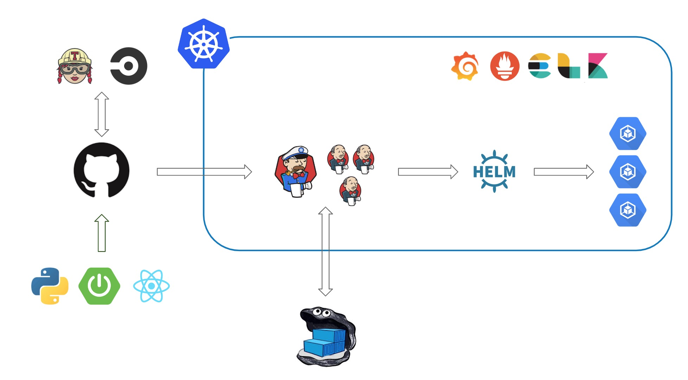
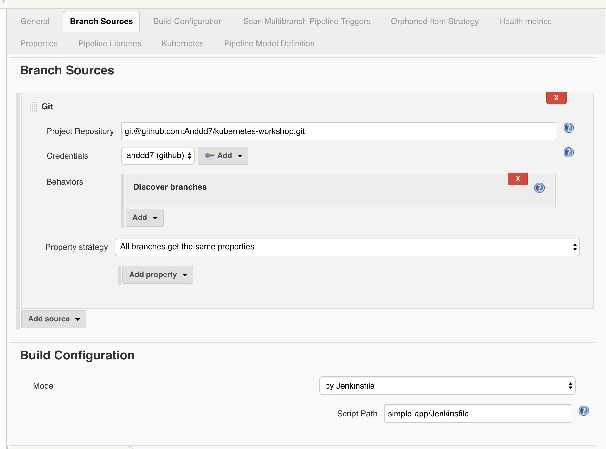

# Deploy your code in kubernetes

Go Go Go...



## Required Environment

MacOS

- **docker-desktop**
  - upgrade to latest version and enable kubernetes
- **helm**

(optional)

- **vagrant**, and add `ubuntu/xenial64 20191108.0.0` if you want to install REAL cluster in VM

- [Deploy your code in kubernetes](#deploy-your-code-in-kubernetes)
  - [Required Environment](#required-environment)
- [Standalone/Single Cluster](#standalonesingle-cluster)
  - [Prepare](#prepare)
  - [Deploy your first application](#deploy-your-first-application)
    - [Resources of k8s](#resources-of-k8s)
    - [Deploy with kubernetes](#deploy-with-kubernetes)
- [Multiple-Nodes-Cluster](#multiple-nodes-cluster)
- [Sharp Weapons](#sharp-weapons)
  - [Helm: The package manager for Kubernetes](#helm-the-package-manager-for-kubernetes)
  - [Kubernetes Dashboard](#kubernetes-dashboard)
    - [kubectl proxy](#kubectl-proxy)
    - [secret](#secret)
  - [Monitoring with Prometheus/Grafana/Alertmanager](#monitoring-with-prometheusgrafanaalertmanager)
    - [port forward](#port-forward)
  - [Tracking/Logging with ELK stack](#trackinglogging-with-elk-stack)
  - [Jenkins (Auto scaling slave)](#jenkins-auto-scaling-slave)
- [How to Production](#how-to-production)
  - [Initial your server and cluster (ignore in local)](#initial-your-server-and-cluster-ignore-in-local)
    - [terraform + kops](#terraform--kops)
    - [terraform + ansible + kubeadm](#terraform--ansible--kubeadm)
  - [CI/CD](#cicd)
  - [Monitoring](#monitoring)
  - [Credentials Managerment](#credentials-managerment)
  - [Authentication](#authentication)
- [Complete Example](#complete-example)
  - [build pipeline with Jenkinsfile](#build-pipeline-with-jenkinsfile)
- [Change the World](#%08change-the-world)

# Standalone/Single Cluster

## Prepare

MacOS

You have 2 ways to set up kubernetes in your desktop.

- Docker Desktop
  - upgrade your Docker Desktop to latest
  - install/enable kubernetes in Docker Desktop
  - check your cluster `kubectl version`

* minikube (a small VM)
  ```bash
  brew install minikube
  # brew reinstall minikube
  minikube start
  minikube ssh
  $minikube kubectl get nodes
  ```

Linux

- [minikube](https://kubernetes.io/docs/tasks/tools/install-minikube/)
- [kubectl](https://kubernetes.io/docs/tasks/tools/install-kubectl/)

## Deploy your first application

docker stack with docker compose

- write docker compose, and set [deploy configuration](https://docs.docker.com/compose/compose-file/)
- deploy into k8s: `docker stack deploy --compose-file=docker-compose.yml simple-app`
- check status: `kubectl get pod` | `kubectl get svc` | `kubectl get deployment`

### Resources of k8s

Pod:

- 最小部署单元
- 由 1~n 个共享资源(volume,ports)的容器组成, 可以通过 localhost 访问彼此
- 异常终止无法自动恢复

ReplicaSet:

- define pod template
- 副本控制, auto scale to expected replicas
- 滚动升级, 自动调整 Pod 配置和副本数量

Deployment:

- 升级版 RS, has deploy status

Service:

- network management
- load balancing
- expose port

### Deploy with kubernetes

- (optional) convert docker compose with [kompose](https://github.com/kubernetes/kompose)
- write configuration file, then: `kubectl apply -f kubernetes.yml`

# Multiple-Nodes-Cluster

Vagrant (ref `Vagrantfile`)

- install docker
- install kubectl
- install kubeadm (master)
  - copy config file to node
- run: `vagrant ssh k8s-master`/`kubectl get nodes`

# Sharp Weapons

## Helm: The package manager for Kubernetes

packaged kubernetes application (contains full configuration)

- [install and initial](https://helm.sh/docs/intro/install/)
- deploy chart with `helm install <name> <chart_name> -n <namespace>`
- list `helm list --all-namespaces`

## Kubernetes Dashboard

a fancy and multifunction dashboard

```bash
# install with recommended config
kubectl apply -f https://raw.githubusercontent.com/kubernetes/dashboard/v2.0.0-beta6/aio/deploy/recommended.yaml

# install with helm (recommended)
helm install kubernetes-dashboard stable/kubernetes-dashboard -n kubernetes-dashboard

# install with customized config (expose with node port)
kubectl apply -f k8s-dashboard.yml
```

### kubectl proxy

kubernetes proxy will expose inner service to 8081, can access services with:

```bash
kubectl proxy
# kubectl proxy --address 0.0.0.0 --accept-hosts '.*'
```

access the service with: `http://<kubernetes_master_address>/<api>/v1/namespaces/<namespace_name>/services/[https:]<service_name>:<port_name></port_name>/proxy`

e.g Dashboard: http://localhost:8001/api/v1/namespaces/kubernetes-dashboard/services/https:kubernetes-dashboard:https/proxy

### secret

Don't forget get the secret of dashboard from `kubectl get secrets`

## Monitoring with Prometheus/Grafana/Alertmanager

a lot of super fancy dashboards

```bash
# 全家桶 with helm
helm install prometheus-operator stable/prometheus-operator -n monitoring

kubectl get pods -n monitoring
kubectl get svc -n monitoring

# proxy (tips: need to modify helm config to redirect grafana api)
kubectl proxy
curl http://localhost:8001/api/v1/namespaces/monitoring/services/prometheus-operator-prometheus:web/proxy/
```

[More detals](https://itnext.io/kubernetes-monitoring-with-prometheus-in-15-minutes-8e54d1de2e13)

### port forward

expose pod's port to node's port

```bash
# port-forward
kubectl port-forward -n monitoring <pod> <port>

# edit and expose service with node port
kubectl edit svc <service_name>
```

## Tracking/Logging with ELK stack

> !!! delete other chart first, due to memory CPU limit

```bash
# 一键安装
helm install elk stable/elastic-stack -n elk
```

## Jenkins (Auto scaling slave)

```bash
# 一键安装
helm install jenkins stable/jenkins -n jenkins
```

**config a multiple stage pipeline**

```groovy
node {
    stage('Hello') {
        echo 'Hello'
    }
    stage('Processing') {
        echo 'Processing'
    }
    stage('Finished') {
        echo 'Finished'
    }
}
```

**check kubernetes cluster**

```console
NAME                       READY   STATUS    RESTARTS   AGE
default-frbl9              1/1     Running   0          10s
jenkins-74ccbf79d6-b6v7r   1/1     Running   1          2d
```

# How to Production

**target: build a pipeline to deploy your code to kubernetes cluster with different environment**

_关于 AWS EKS 的部分只是通过采访和脑补进行的架构设计, 还未进行过实践._

## Initial your server and cluster (ignore in local)

**[terraform](https://www.terraform.io/)**: infrastructure resouces as code, manage S3, RDS as well as EC2

- ref [cloud formation](https://aws.amazon.com/cloudformation/)

**ansible**: infrastructure server as code, exec command in cluster

- simplify shell
- e.g https://github.com/ctienshi/kubernetes-ansible/blob/master/centos/playbooks/setting_up_nodes.yml
- e.g [set up k8s cluster on vagrant with ansible](https://kubernetes.io/blog/2019/03/15/kubernetes-setup-using-ansible-and-vagrant/)

**[kops](https://github.com/kubernetes/kops)**: create resouce and set up kubernetes cluster with one command

- terraform + ansible ?
- integrate with terraform
- ref [eksctl](https://eksctl.io/)

**kubeadm**: set up cluster

- have to install required tools before this

### terraform + kops

[Deploying Kubernetes clusters with kops and Terraform](https://medium.com/bench-engineering/deploying-kubernetes-clusters-with-kops-and-terraform-832b89250e8e)
[Building Kubernetes clusters with Terraform](https://github.com/kubernetes/kops/blob/master/docs/terraform.md)

### terraform + ansible + kubeadm

can customize server with ansible

## CI/CD

- Git
  - source code
- Jenkins
  - test: report
  - build: dist/jar...
  - docker build: image with new tag
  - deploy dev: helm install with dev environment
  - deploy ...
- Docker registry
  - docker image in registry
- Helm registry
  - helm config in registry

## Monitoring

- elk
- prometheus
- kubernetes dashbord
- ...

> [cloud watch](https://aws.amazon.com/cloudwatch/)

## Credentials Managerment

should separate with other code, only visible for devops and manager

- helm
- vault

## Authentication

- kubernetes scretes
- aws iam

# Complete Example

## build pipeline with Jenkinsfile

Jenkinsfile - build

- kubernetes-plugin
- docker-plugin

pipeline


Jenkinsfile - deploy

Heml

# Change the World

Service Mesh
Serverless

[istio](https://istio.io/)
[quarkus](https://quarkus.io/)
[vertx](https://vertx.io/)
